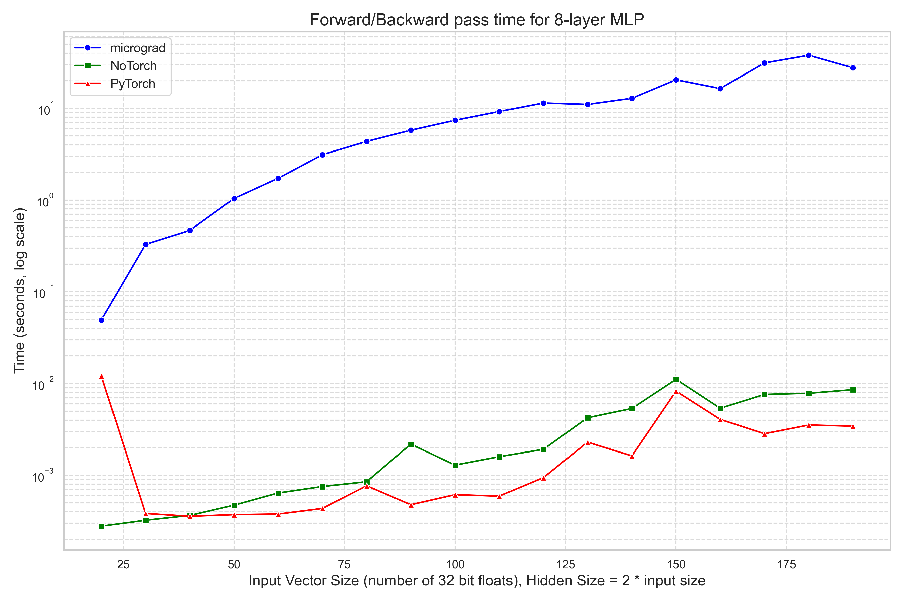

<h1>NoTorch</h1>

A 'from scratch' implementation of a deep learning library (no pytorch/tensorflow) built only on NumPy. 

This is a learning project heavily inspired by and based on Andrej Karpathy's micrograd:
https://github.com/karpathy/micrograd


FEATURES:

- A matrix valued autograd engine, allowing for 24 (and counting) differentiable matrix operations

- Neural Networks

- Transformers

- Extremely fast performance, speeds similar to PyTorch. Orders of magnitude faster than micrograd (see speed_test.py)


SPEED TEST:

I compared performance for a single forward and backward pass with an 8 layer network while varying the input size:



<br>
<h1>How to Use</h1>
Install poetry: https://python-poetry.org/docs/#installation

To run speed_test.py: (OSX/Linux)
```
$ git clone https://github.com/Lucasc-99/NoTorch
$ cd NoTorch
$ poetry install 
$ poetry run python speed_test.py
```
